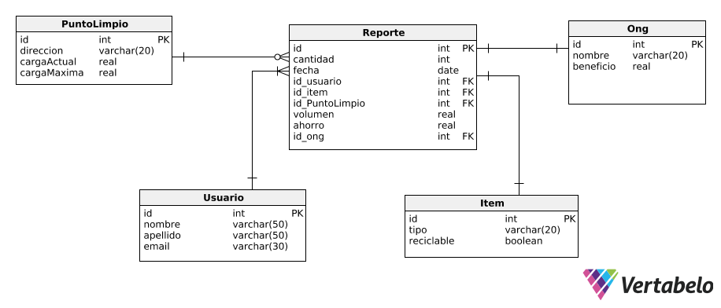

# Arquitecturas web #

### Profesores ###
* J. Andrés Díaz Pace
* Juan Manuel Rodriguez

### Índice ###

1. [Introducción](#Introducción)
2. [Sistema](#Sistema)
3. [Modelo de datos](#Modelo-de-datos)
4. [API](#API)
    * [ONG](#ong)
    * [Punto Limpio](#punto-limpio)
    * [Reporte](#reporte)
    * [Item](#item)
    * [Usuario](#usuario)

## Introducción ##
 Se realizó el diseño y la implementación de un sistema de recolección de residuos. Un modelo para minimizar el esfuerzo en clasificación de los materiales es la separación de residuos en origen, esto es, en el domicilio.
 Específicamente, se busca implementar una aplicación Web para asistir a los vecinos de Tandil a registrar los elementos que reciclan, ofreciendo además información de interés y estadísticas personalizadas. La aplicación también será accesible por el Municipio de Tandil y le permitirá́, en principio, visualizar diversas estadísticas, proyecciones e historial de reciclaje por vecino/cuadra/barrio. 

## Sistema ##

 El sistema está compuesto por diversos packages separados por módulos: Usuario, reporte, puntolimpio, etc
 Cada módulo se subdivide en packages separando por las diferentes capas y responsabilidades desde la exposición de los servicios hasta la persistencia sobre la base de datos

## Modelo de datos ##

El modelo de datos de la aplicación se encuentra de la siguiente manera:

## API ##

### ONG ###

| Endpoint  | Método | Utilidad |
|---|---|---|
|  /ong | GET  | Obtener todas las ONG |
|  /ong/{id} | GET  | Obtener ONG por ID |
|  /ong/ | POST  | Crea una nueva ONG  |
|  /ong/{id} | DELETE  | Elimina una ONG por ID  |
|  /ong | DELETE  | Eliminar todas las ONG |

### Punto-Limpio ###

| Endpoint | Método | Utilidad |
|---|---|---|
| /puntolimpio/  | GET  | Obtener todos los puntos limpios |
| /puntolimpio/{id}  | GET  | Obtener un punto limpio por ID |
| /puntolimpio/  | POST  | Crear un punto limpio |
| /puntolimpio/  | DELETE  | Eliminar todos los puntos limpios |
| /puntolimpio/{id}  | DELETE  | Eliminar un punto limpio por ID ||

### Reporte ###

| Endpoint | Método | Utilidad |
|---|---|---|
| /reporte/  | GET | Obtener todos los reportes |  
| /reporte/{id}  | GET  | Obtener un reporte por ID  |
| /reporte/  | POST   | Crea un nuevo reporte |  
| /reporte/  | DELETE  | Elimina todos los reportes  |
| /reporte/{id}  | DELETE  | Elimina un reporte por ID  |

### Item ###

| Endpoint | Método | Utilidad |
|---|---|---|
| /item/  | GET  |  Obtiene todos los Items |
| /item/{id}  | GET  | Obtiene un item por ID |
| /item/  | POST  | Crea un nuevo item  |
| /item/{id}  | DELETE  | Elimina un item por ID  |
| /item/  | DELETE  | Elimina todos los items  |
|   |   |   |

### Usuario ###

| Endpoint | Método | Utilidad |
|---|---|---|
| /usuario/  | GET  | Obtiene todos los usuarios de la aplicación  |
| /usuario/{id}  | GET  | Obtiene un usuario por ID  |
| /usuario  | DELETE  | Elimina todos los usuarios de la aplicación  |
| /usuario/{id}  | DELETE  | Eliminar un usuario por ID |
| /usuario/  | POST  | Crea un nuevo usuario en la aplicación  |

